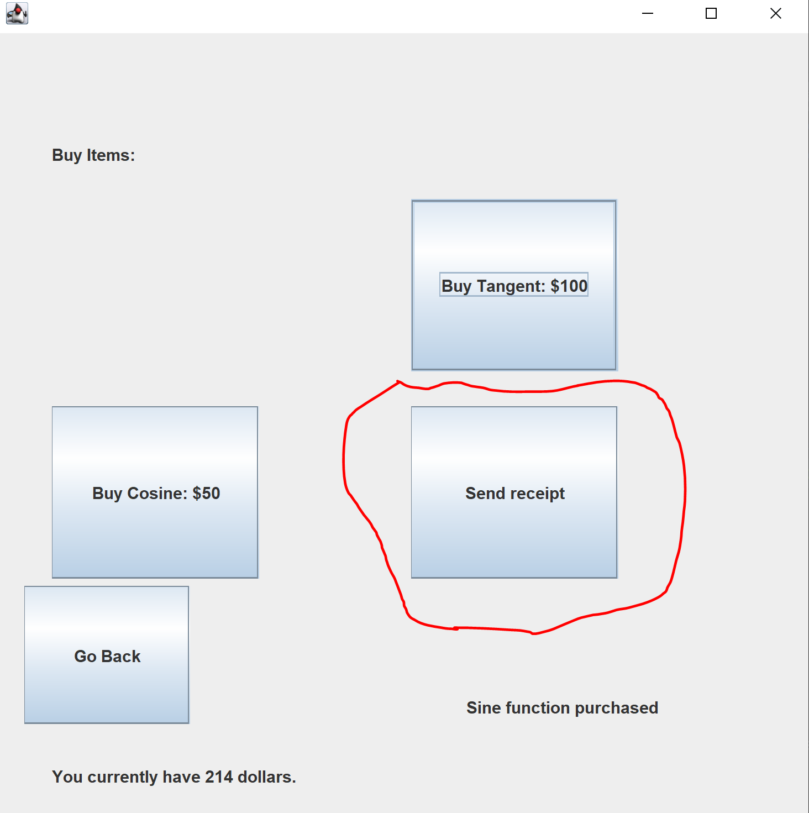

# CSA-Portfolio

By Alex Titov, Andrew Pu, Sean Rollins, Eyaad Mir, and Neil Sahai

This portfolio is composed of a set of minilabs, which will allow you to earn money in order to "buy" different functions of our calculator. 

# Week 11
## Usage
Prerequisites:

Java JDK
IntelliJ

All of our labs can be accessed by running the Main.java file.

## Features

Here is a diagram of our project in BlueJ.

| Lab | Description |
| --- | --- |
| Calculator | Calculator with many functions like addition, subtraction, multiplication, division, powers, sine, cosine, tangent, log, and ln. 
| Store | A store that allows the user to purchase the sine, cosine, and tangent functions for the calculator. User must spend money that was earned by playing the games in this portfolio.
| ATM | ATM allows the user to deposit the money that they earned from games and withdraw it for later use, specifically, you can save the money in the ATM to buy when there are new functions are added to the store.
| Rock Paper Scissors | User plays rock paper scissors with the computer and gains coins for the store if they win the round.
| HighLow | User recieves a number and has to guess if the next number will be higher or lower. If they are correct, they gain coins for the store. This game features [Model](./src/Games/HLModel.java), [View](./src/Games/HLView.java), and [Control](./src/Games/HLControl.java).
| Chimp | User is presented with a certain order to press buttons. If they memorize it and press the buttons in the right order, they gain points and can continue. The game gets harder each round the user continues. The user earns coins for each point they get.
| Numbers | User has to memorize the number presented to them and type it back. If they are correct, they gain points and can continue. The number the user has to memorize gets longer each round the user continues.
| Quiz | Presents the user with a variety of multiple-choice randomly-generated math questions. Types of questions range in difficulty from basic addition and multiplication (albeit of large numbers), to trickier ones, such as finding the product of the roots of a quadratic equation. All answers, including the 3 fake answers, are integers. If the user guesses the correct answer, 5 coins are added towards expenditures in the store. There is no penalty for incorrect answers. The correct answer of the previous question is set to display.
| Gmail | Extention to the store which allows user to get a receipt of their purchases. More on how this was done down below in "Creativity"

## Demos

### Calculator

### Store

### ATM

### Games

#### Rock Paper Scissors

#### HighLow

#### Chimp Memory Game

#### Numbers Memory Game

#### Quiz

## Communication
NATM link: http://ntm.nighthawkcoders.cf/p1_asciimenu/

Video guide link: https://www.youtube.com/watch?v=y1jqfy87D-w
Video features us explaining AP Requirements, MVC, and queues in our project.

Eyaad, Neil, and Andrew's MVC Calculator and Journal links: https://github.com/Neil-Sahai/TrioProjects
https://docs.google.com/document/d/1Abg1L0foYwqYoHOs44TMDWZlAnQGxRZljYbNfsRkGZE/edit

Alex and Sean's Calculator and Journal links:
https://docs.google.com/document/d/179YQwRy_Z3VPrH-tna0JrGzOdYIIuOfOYXNn2D1xtVA/edit?usp=sharing

** Note: Alex and Sean's Calculator is the one we used in our portfolio. Unfortunately, we were unable to figure out how to have an MVC Calculator along with the XML file. Eyaad, Neil, and Andrew's seperate calculator uses MVC.

Calculators: [CalculatorUI](./src/CalculatorUI/CalculatorUI.java) and [GraphingCalculator](./src/GraphingCalculator/GraphingCalculator.java)

We communicated with each other primarily on slack. In order to integrate all of our labs together, we had to communicate with each other thoroughly. We were very successful in communicating with each other and Mr M.

## Collaboration

### Eyaad
Contributor | Evaluation Score | Reasoning
----------- | ---------------- | ----------
Neil Sahai  |        10         | Worked on and successfully completed his [ATM](./src/ATM/ATM.java). Also worked on integrating us with [NATM](http://ntm.nighthawkcoders.cf/p1_asciimenu/). Added the [sine](https://github.com/alextitov19/CSA-Portfolio/blob/64f4be8be80b987550c45d279c95ca1e7d214173/src/CalculatorUI/CalculatorUI.java#L440), [cosine](https://github.com/alextitov19/CSA-Portfolio/blob/64f4be8be80b987550c45d279c95ca1e7d214173/src/CalculatorUI/CalculatorUI.java#L443), and [tangent](https://github.com/alextitov19/CSA-Portfolio/blob/64f4be8be80b987550c45d279c95ca1e7d214173/src/CalculatorUI/CalculatorUI.java#L446) functions
Alex Titov  |        10  | Developed the [XML](./XMLs/Users) file that contained coins and allowed us to integrate our project together. Also contributed lots of work to the [Calculator](./src/CalculatorUI/CalculatorUI.java) and did queues with his [Gmail](./src/Gmail/GmailUI.java).
Sean Rollins |       10   | Contributed to one of the "games" that provide money for the store with his [quiz](./src/Quiz/QuizUI.java). Added the [ln](https://github.com/alextitov19/CSA-Portfolio/blob/64f4be8be80b987550c45d279c95ca1e7d214173/src/CalculatorUI/CalculatorUI.java#L449) and [log](https://github.com/alextitov19/CSA-Portfolio/blob/64f4be8be80b987550c45d279c95ca1e7d214173/src/CalculatorUI/CalculatorUI.java#L452) functions to the calculator
Andrew Pu |          10 | Created many "games" that provide money for the store like [HighLow](./src/Games/HighLow.java), which had [Model](./src/Games/HLModel.java), [View](./src/Games/HLView.java), and [Control](./src/Games/HLControl.java).

MVP | Reasoning
--- | ---------
Alex | His work with the XML file was a must have for us to integrate our project.

### Neil
Contributor | Evaluation Score | Reasoning
----------- | ---------------- | ----------
Eyaad Mir  |  10   | Worked on succesfully [integrating the store](https://github.com/alextitov19/CSA-Portfolio/blob/1c48bdd0b445a377b51a3e057a4f05a20d3ba008/src/Store/Store.java#L181) with the calculator functions in a clean and seamless UI. Communicated well with other groups. Also worked hard on the [README](./README.md) to make it display our project information effectively
Alex Titov  |   10  | Worked on connecting all of our mini-labs together through a seamless and well put together [XML](./XMLs/Users). Used queues and added receipts through the [gmail](.src/Gmail/Gmail.)
Sean Rollins |  10  | Created one of many games in our project which you can play to earn money - [quiz](./src/Quiz/QuizUI.java). Sean also added [log and natural log functions to the calculator](https://github.com/alextitov19/CSA-Portfolio/blob/64f4be8be80b987550c45d279c95ca1e7d214173/src/CalculatorUI/CalculatorUI.java#L449)
Andrew Pu | 10  | Worked on multiple games in our project such as [Higher Lower](./src/Games/HighLow.java), [Chimp memory game](./src/Games/Chimp.java), and [Rock Paper Scissors](./src/Games/RPS.java). Included [MVC](./src/Games/) in some of his games aswell.

MVP | Reasoning
--- | ---------
Alex | Without the XML file, our project would have just been a bunch of random, individual labs rather than one customer focused deliverable. He added new challenging things to his code and communicated well.

### Alex
Contributor | Evaluation Score | Reasoning
----------- | ---------------- | ----------
Neil Sahai  |     10|Worked hard and was on time with completing [tasks](./src/ATM/ATM.java). Took up extra tasks lite integrating project into Night at the Museum. Excelled at communicating with the team.
Eyaad Mir  |     10|Developed a complicated [feature](./src/Store/Store.java) to the program which allowed the user to purchase [items](./src/Store/Store.java#L98) which would then be saved in the [XML file](./XMLs/Users) and directly affect the app's usability. Communicated well with the team members and met all deadlines for the project.
Sean Rollins |      10|Created a [mini game](./src/Quiz/QuizUI.java) that tested user's knowledge and gave our app variety. Took up tasks and finished them on time while communicating well with team and pair-share.
Andrew Pu |   10|Coded many [key elements](./src/Games) to the project which gave the user a [variety](./src/Games/HighLow.java) of [options](./src/Games/Numbers.java) to choose from. Assisted in conecting to the Night at the Museum. Finished tasks on time and communicated well.

MVP | Reasoning
--- | ---------
Eyaad | Communicated well within the team, with Mr. Mortensen, and with other teams.

### Sean
Contributor | Evaluation Score | Reasoning
----------- | ---------------- | ----------
Neil Sahai  |  10   | Neil was responsible for the [ATM](./src/ATM/ATM.java), which allowed the user to deposit and withdraw money. Not only that, he is chiefly responsible for [N@TM integration](http://ntm.nighthawkcoders.cf/p1_asciimenu/), having been the only one to attend Mr. Mortensen's integration meeting.
Alex Titov  |  10   | Alex mainly worked on the [XML](./XMLs/Users) file, but also with the [mail](./src/Gmail/GmailUI.java) functionality. He frequently committed, and informed us well of the important changes he made to his code.
Eyaad Mir |  10    | Eyaad worked mainly on the [store](./src/Store/Store.java), which was the unifying part of our project; it connected the games to the calculator. Due to the importance of the store, he was also very informative with the rest of the team about his process.
Andrew Pu |  10 | Andrew worked on a number of games including [highlow](./src/Games/HighLow.java), and [rock paper scissors](./src/Games/RPS.java). His code is very adherent to mvc guidelines. He was communicative despite the fact that he mainly worked by himself.

MVP | Reasoning
--- | ---------
Alex | Alex, demonstrating a deep knowledge of workings inside and outside of Java, was our go-to man if there was at all a problem. His experience with XML bound the project together; without it, there would be no central purpose of the project.

### Andrew
Contributor | Evaluation Score | Reasoning
----------- | ---------------- | ----------
Neil Sahai  |     |
Alex Titov  |     |
Sean Rollins |      |
Eyaad Mir |   |

MVP | Reasoning
--- | ---------
xxx | 

## Scrum Master MVP Evaluation
To pick the MVP of our scrum team, I had each member vote for who they thought was the most important in our team. Our group members decided on Alex Titov, for his large contributions to the XML file that integrates our project together.

## Creativity
The most notable example of creativity in our project was Alex's gmail program. In the past, Mr. M had highlighted stacks and queues as something to put in our project. Mr. M had also personally suggested we use our gmail program to make a receipt for the store. So, Alex set out to use queues to make our gmail program send receipts:

   

He used the queues to [enqueue](https://github.com/alextitov19/CSA-Portfolio/blob/edbaf76ca6eb563e79151461f41d129279e31ce8/src/Gmail/Gmail.java#L28) and [dequeue](https://github.com/alextitov19/CSA-Portfolio/blob/edbaf76ca6eb563e79151461f41d129279e31ce8/src/Gmail/Gmail.java#L32) the user's purchases.

# Week 8 Progress:

As of now, we have created our individual mini labs that we will integrate together for our final project. Last week, we had minilabs but we did not have a clear plan on how to put these together. Now, we have a full plan on how we are going to put together all of our assignments. Do note that integration has not been finished, so as of now our labs are not connected through money and many labs such as the Store and ATM have placeholder money values and variables. However, we will be working on the connection of these labs next week. We will also be adding more calculator functions to "buy" next week.

    Eyaad - Store
  
    Neil - ATM
    
    Andrew, Sean, Alex - Games
  
    Alex - Email receipt, XML file, and storing data
   
## Week 8 - Scrum Master Grades
Contributor | Grade | Reasoning 
----------- | --------------------- | ---------------------------------------------
Neil Sahai | 5/5 | He worked on connecting his ATM to the [Playground.Playground menu](https://github.com/alextitov19/CSA-Portfolio/blob/3e8eb7b29831f7b04d8b3398f58ac66254a12e15/src/Menu/MenuUI.java#L61) and he also added to the ATM.java file by creating the [main panel](https://github.com/alextitov19/CSA-Portfolio/blob/e144b5ac0077c6de00be99166d22e07244117647/src/ATM/ATM.java#L84) and the [locations of the buttons](https://github.com/alextitov19/CSA-Portfolio/blob/4ddd1000cb6ab43c82b66553d9425d7aaa6bf4d6/src/ATM/ATM.java#L121) which shows up after you login correctly. In addition you can begin to deposit and withdraw money. He also added the logic to the [deposit and withdraw buttons](https://github.com/alextitov19/CSA-Portfolio/blob/67655c410af48ecd705aa6327d9c2ffc20e38fba/src/ATM/ATM.java#L138) and made sure that the operations within the ATM are working with their intended purposes by stress testing. To use the ATM, the user logs in using the username CSA and the password test. He fully met all of the goals he set this week. Next week, he will be working with the group on integrating projects together with a global persistent variable "money" which will connect all of our code and better the logic for the deposit and withdraw buttons.
Eyaad Mir | 5/5 | I connected my store to the [Playground.Playground menu](https://github.com/alextitov19/CSA-Portfolio/blob/3e8eb7b29831f7b04d8b3398f58ac66254a12e15/src/Menu/MenuUI.java#L55) and also created the logic to allow the user to press a [button](https://github.com/alextitov19/CSA-Portfolio/blob/64fe613bc2df761fcfecbf283c45c7bc797625a8/src/Store/Store.java#L54) to get them to the items part of the store. I also had button logic for the user to buy [books](https://github.com/alextitov19/CSA-Portfolio/blob/fde249a635071d43a7e94ddf11dfc84c5d99fcba/src/Store/Store.java#L141) and [cards](https://github.com/alextitov19/CSA-Portfolio/blob/fde249a635071d43a7e94ddf11dfc84c5d99fcba/src/Store/Store.java#L164). Finally, I had the GUI specify how much [money](https://github.com/alextitov19/CSA-Portfolio/blob/fde249a635071d43a7e94ddf11dfc84c5d99fcba/src/Store/Store.java#L103) the user had and the [items](https://github.com/alextitov19/CSA-Portfolio/blob/fde249a635071d43a7e94ddf11dfc84c5d99fcba/src/Store/Store.java#L104) the user had. I met all of the goals I set for the week. Next week I plan to integrate my code to fit the project, as the book and cards were just placeholders to demonstrate the code.
Andrew Pu | 5/5 | He manually created a higher/lower game where the user guesses if the next number will be higher or lower than the last. He first learned how to manually create a GUI (without a form file). He created the components (<a href = "https://github.com/alextitov19/CSA-Portfolio/blob/2cb6a17fcfb3a25c4151ea12d7968ca5fd542570/src/Games/HighLow.java#L14">line 14</a>; <a href = "https://github.com/alextitov19/CSA-Portfolio/blob/2cb6a17fcfb3a25c4151ea12d7968ca5fd542570/src/Games/HighLow.java#L118">line 118</a>), specified their constraints (<a href = "https://github.com/alextitov19/CSA-Portfolio/blob/2cb6a17fcfb3a25c4151ea12d7968ca5fd542570/src/Games/HighLow.java#L160">line 160</a>), and added them to the panel (<a href = "https://github.com/alextitov19/CSA-Portfolio/blob/2cb6a17fcfb3a25c4151ea12d7968ca5fd542570/src/Games/HighLow.java#L129">line 129</a>). Then he added action listeners for the buttons and the logic for the game (<a href = "https://github.com/alextitov19/CSA-Portfolio/blob/2cb6a17fcfb3a25c4151ea12d7968ca5fd542570/src/Games/HighLow.java#L34">line 34</a>; <a href = "https://github.com/alextitov19/CSA-Portfolio/blob/2cb6a17fcfb3a25c4151ea12d7968ca5fd542570/src/Games/HighLow.java#L180">line 180</a>). At the end of the week, he also learned how to set fonts (<a href = "https://github.com/alextitov19/CSA-Portfolio/blob/2cb6a17fcfb3a25c4151ea12d7968ca5fd542570/src/Games/HighLow.java#L138">line 138</a>).
Sean Rollins | 4/5 | Last week, we decided that my Animals mini-project does not fit with the theme of the project, so Sean decided to make a quiz instead. This week his goals were to create a working prototype of the quiz, and integrate it to the rest of the program. He first made [QuestionGenerator](https://github.com/alextitov19/CSA-Portfolio/blob/main/src/Quiz/QuestionGenerator.java), which has methods to construct, [return the text of](https://github.com/alextitov19/CSA-Portfolio/blob/main/src/Quiz/QuestionGenerator.java#L19), and [compute the answer to](https://github.com/alextitov19/CSA-Portfolio/blob/main/src/Quiz/QuestionGenerator.java#L9), a question, [given an arbitrary question type and 2 parameters](https://github.com/alextitov19/CSA-Portfolio/blob/main/src/Quiz/QuestionGenerator.java#L39). [QuizUI](https://github.com/alextitov19/CSA-Portfolio/blob/main/src/Quiz/QuizUI.java) on the other hand acts as both the view and control(He tried seperating the two but couldn't get it to work), with methods to [display the question](https://github.com/alextitov19/CSA-Portfolio/blob/main/src/Quiz/QuizUI.java#L109), [possible choices](https://github.com/alextitov19/CSA-Portfolio/blob/main/src/Quiz/QuizUI.java#L113), and evaluate whether the answer is correct. If correct, the amount of spendable money the user has is set to [increase](https://github.com/alextitov19/CSA-Portfolio/blob/main/src/Quiz/QuizUI.java#L35) by an arbirtary amount once our team sets a global variable for the amount of money. His minilab is also accesable from the [menu](https://github.com/alextitov19/CSA-Portfolio/blob/main/src/Menu/MenuUI.java) as well. I will deduct Sean one point because his [answer choices](https://github.com/alextitov19/CSA-Portfolio/blob/main/src/Quiz/QuizUI.java#L113) are not generated and randomized, only the correct one is generated and it is always at the first button.
Alex Titov | 5/5 | Alex started work on the [XML](https://github.com/alextitov19/CSA-Portfolio/blob/main/src/Playground/XmlReader.java) file. He also worked on it [here](https://github.com/alextitov19/CSA-Portfolio/blob/main/XMLs/Users). He was able to finish the XML reader and plans to work on the XML writer over the weekend. This will allow us to integrate all of our code together into one final project. 

## Group Grade
Grade | Reasoning
----- | ---------
19/20 |  We completed all of our goals for the week. We are on pace to start integrating our project together next week. We compiled all of our progress and goals into this README. While last week our project plan was confusing and unclear, now our project is going in a clear direction.

## Usage
Prerequisites:

- Java JDK
- IntelliJ

All of our code can be run in the Playground.Playground.java file except for the HighLow game. This can be found at CSA-Portfolio\src\Games\HighLow

## Goals for Next Week
- Start integration of all of our mini labs and connect it to calculator.
- Convert our code into Model View Control format.

## Project Credits
Contributor | GitHub Link |
----------- | ----------- |
Neil Sahai | [@Neil-Sahai](https://github.com/Neil-Sahai)
Eyaad Mir | [@EyaadM](https://github.com/EyaadM) 
Andrew Pu | [@andrewzpu](https://github.com/andrewzpu)
Alex Titov | [@alextitov19](https://github.com/alextitov19)
Sean Rollins | [@banditcat12](https://github.com/banditcat12)

# Week 7
10/23/2020

Compendium of various mini-labs for AP CSA.

All of the labs are located in \CSA-Portfolio\src\. You can find the labs and run them here.

Andrew Pu: (5/5)

This week I worked on a rock, paper, scissors game as
my mini project. I know that rock, paper, scissors is a pretty
basic game to code, but I wanted to start off with something easy
in order to get the hang of JFrames and GUI designing. I set up
the GUI for the game and added action listeners for the buttons.
I set the action listeners to take the user's choice and a
randomly generated choice to determine whether the user won
or not. To do this, I included switch statements to convert
the user's selection to an actual choice and set the images
(the user and the CPU each have a hand image that shows their
choice). Based on whether the result is win, lose, or tie, I
also change the text on the labels and also added a score
counter. I also figured out that I could add images to labels in
JFrame. I tried to add animation, but the delay didn't seem to
work; it just made my program lag a lot, so I decided to remove
it. Overall, I think made a decent amount of code, but I could've
added more features and maybe started another project this week.
I would give myself a 5/5.

All the code is in \CSA-Portfolio\src\Games\RPS

Next week I am planning on setting up a game menu which switches
to a certain game's panel when the button is clicked. I was going
to just make another project that creates a new JFrame when the
game is chosen, but during the forum I heard about card layouts,
which I thought might be more effective for my project.

Alex Titov: (5/5)

This week I was able to complete both of the labs I set out to complete. The graphing calculator was an interesting concept and I decided to go at it without looking up someone else’s calculator and simply copying that. I decided to create an array in order to store the x and y coordinates for N amount of data points. I devised a formula that would calculate the y coordinates based on the given x input. The user also has an amount of variables they can alter, essentially making possible to graph most of the exponential functions. I could not figure out how to add labels in time and neigher how to center the graph, so it will look quite odd. 
The gmail lab was pretty simple. Most of the time was spent learning and finding the jar files. The tricky thing was, one of those files was no longer available to the proper website so I had to sneak around github and sort of pirate it off of someone else’s project. Apart from that, the lab was quite easy. I ended up looking up quite a bit of tutorials just because this code is very nuanced and there is a procedure of things you have to add to the code that I’ve never used before. This lab was probably my favorite java thing I’ve done so far just because it is actually useful. Unlike printing ascii art or making a simple calculator, this lab can actually send emails. Most likely no one will ever use it because you have to disable all of your security features on your gmail account in order to run it, but that’s besides the point.

Eyaad Mir: (4/5)

This week we started our individual projects while finishing up the calculator. For me, I worked on my store project. Even though we started last week, I wasn't used to Intellij so I watched some videos online to figure out how to program my GUI. While I finished my GUI, I did not have any code behind my buttons, which I think I should have done. I would give myself a 4/5.

Neil Sahai: (4/5)
This week I began to develop my individual mini project. My project intent over these next few weeks is to develop and login, deposit, and withdraw functions which a user can use after logging in to save their money. This week I began to develop the login function. This started with me building the necessary components to do so. This included the JFrame, JPanel, userfield, userlabel, passwordfield, passlabel, update label, and the login label. This is seen in the journal. After doing that part, I had to position the pieces and set the dimensions for them. This built up the main part of the GUI and the location of where the parts were. Finally, I added the logic behind the login button to make sure that the currently only username and password is accurate and did this by using an if else statement. I was having issues connecting the logic to the button, so I will have to work on this next week. This was also from where I got my AHA moment as I realized that getText() was not working for the password field. As a result, I had to do research, and I found out that you have to use the valueOf option as the password field is encrypted. My goals for the next week is to finish up the login UI and add a new user function to it and begin on the main UI where you deposit and withdraw. All in all, I would give myself a 4/5 this week as I was able to accomplish a lot but I could have done more.

Sean Rollins (4/5)
I got started with my animals minilab. The goal for this minilab is to adapt our previous animals group lab to a gui, using MVC principles, where the model is unchanged, but the view and control are changed. This week I worked on the view aspect of it. I created the GUI to be split between a display on the right, and buttons on the left for which animals to show, and in what quantity. I created a skeleton for this via IntelliJ Swing GUI, though it took me long to do so because I was not really familiar with GUI design(for the calculator, my partner did  all the gui, while my work was 100% backend). I only got started after various tutorials regarding Swing UI designer. There are some button listeners for some animals, but they only function by changing the label text on the right side, indicating the selected animal. I want to be able to work more on the view part next week. Mainly, I want to: add color to the program, and make the program able to display (multiple) images of animals instead of text. I would also hope to get part of the control done which allows the user to control the quantity of animals being printed.

